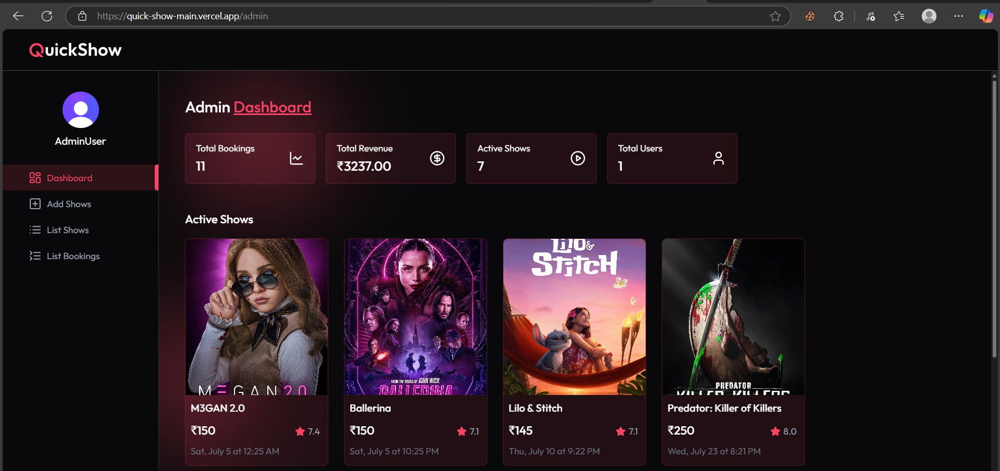
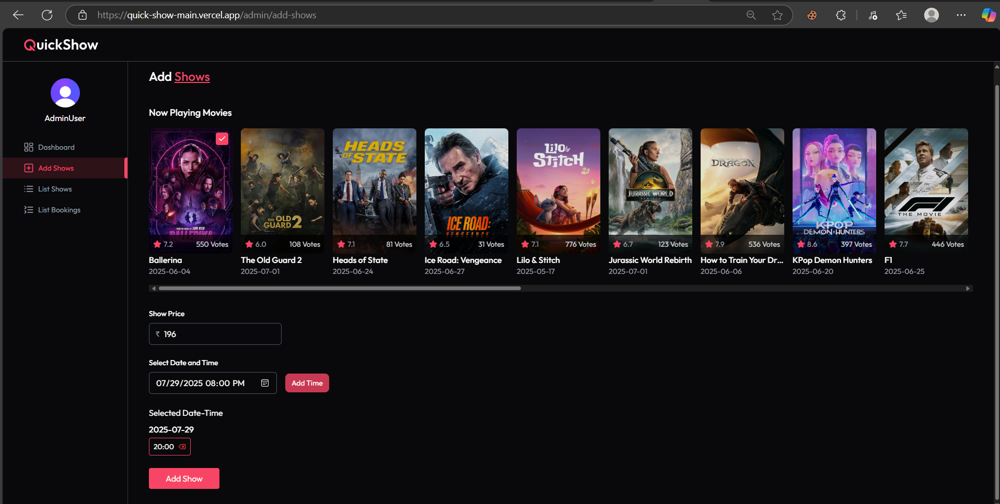
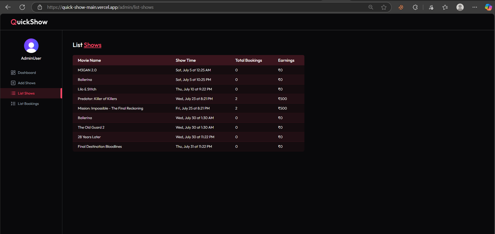
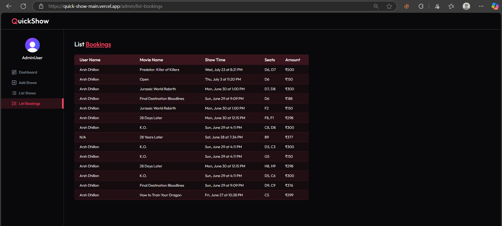

# 🎬 QuickShow  
*Your Ultimate Movie Ticket Booking Platform*

---

QuickShow is a modern, full-stack application for seamless movie ticket booking. Browse movies, view details, book seats, and pay securely with Razorpay. Enjoy a robust admin dashboard, secure authentication via Clerk, and automated background jobs powered by Inngest.


https://github.com/user-attachments/assets/c22e1b7a-4941-486e-a832-e99fc0e0fc3a


https://github.com/user-attachments/assets/623748e3-1069-4123-858f-0750a4b3f59b


---

## 🚀 Tech Stack

| Layer      | Technologies                                                                 |
|------------|------------------------------------------------------------------------------|
| **Frontend** | React.js (SPA), Vite, Tailwind CSS, Lucide React, React Router, Clerk, Razorpay JS SDK |
| **Backend**  | Node.js, Express.js, MongoDB + Mongoose, JWT, Razorpay API, TMDB API, Inngest |

---

## 📁 Folder Structure

```
quickshow/
├── client/         # React frontend
│   ├── src/
│   │   ├── components/
│   │   ├── pages/
│   │   ├── context/
│   │   └── lib/    # Helper functions
│   └── public/
├── server/         # Node.js backend
│   ├── controllers/
│   ├── models/
│   ├── routes/
│   ├── middleware/
│   └── utils/
```

---

## ⚙️ Features

### 👥 Authentication
- Email sign in / sign up (Clerk)
- JWT-based route protection (frontend & backend)
- User & admin protected routes

### 🎥 Movie Experience
- Fetch latest & trending movies (TMDB)
- View details: title, genre, runtime, poster
- Filter by genre & release date

### 🪑 Ticket Booking
- Real-time seat selection (disabled if booked)
- Book multiple seats at once
- Generate stylish movie ticket for print/download

### 💳 Payments
- Create order from backend
- Complete payment via Razorpay UI
- Payment status verification & update

### 🧾 Ticket PDF
- Print-friendly, dark-themed ticket
- Includes seat, time, amount, booking ID


#### 🔒 `/admin` Route Security & Usage

- The `https://quick-show-main.vercel.app/admin` route provides access to the admin panel.
- Only users with the role: `"admin"` can access this route; all others are denied entry.
- Admins can list all existing shows and add new shows for the application through this panel.
- Secure dashboard
- View all bookings
- Manage movie shows & time slots
- Revenue analytics





### ⏱️ Background Tasks
- Confirmation email after payment
- Optional: reminders, analytics updates (Inngest)

---

## 🔐 Environment Variables

Create a `.env` file in both `client/` and `server/` directories.

### **Frontend** (`client/.env`)
```env
VITE_CLERK_PUBLISHABLE_KEY=your_clerk_publishable_key
VITE_BACKEND_URL=http://localhost:5000
VITE_CURRENCY=₹
```

### **Backend** (`server/.env`)
```env
PORT=5000
MONGO_URI=your_mongodb_connection_string
JWT_SECRET=your_jwt_secret
CLERK_SECRET_KEY=your_clerk_backend_key

TMDB_API_KEY=your_tmdb_api_key

RAZORPAY_KEY_ID=your_razorpay_key_id
RAZORPAY_KEY_SECRET=your_razorpay_key_secret
```

---

## 💻 Local Development

### 1️⃣ Backend Setup
```bash
cd server
npm install
npm run server
```

### 2️⃣ Frontend Setup
```bash
cd client
npm install
npm run dev
```

---

## 🖨️ Printing Tickets

- Print directly from the **My Bookings** page.
- Click **"Print Ticket"** to:
    - Open a styled PDF preview
    - Auto-trigger the browser's print dialog
    - Generate a dark-themed ticket with booking details

---

## ✅ Future Improvements

- Real-time seat lock (WebSocket-based)
- Admin notifications (Inngest + Clerk)
- Advanced analytics dashboard (Revenue, Bookings per movie)
- Support for multiple payment providers (e.g., Stripe)

---


